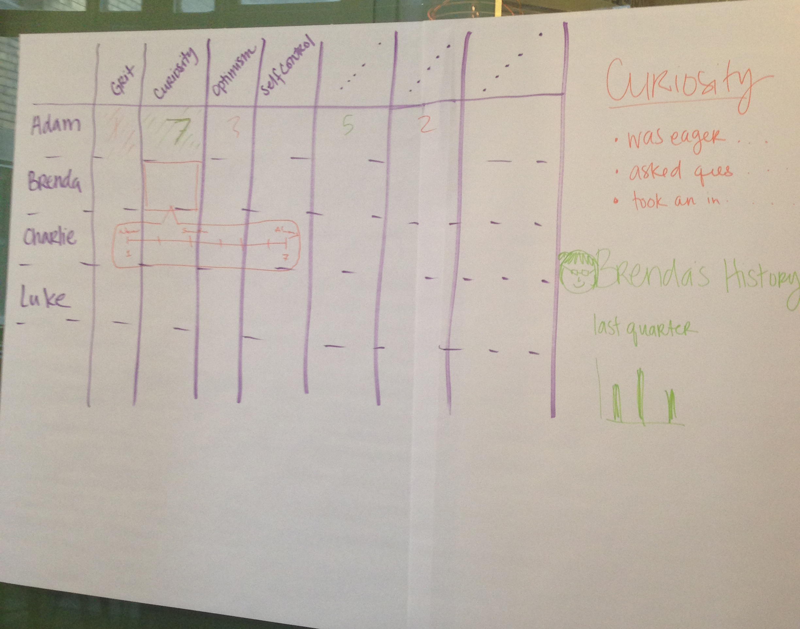

# 3 12 3

**Supplies needed:** Easel Pad, Paper, Sharpie

**Estimated time:** 30 Minutes

## Best to use when
3-12-3 is best to use for large groups of people that are looking to converge on
to one single idea. It alleviate any large group think by splitting groups into
teams of people. The time restraint is meant for people to be concise about
there thinking and explanations.

> This format for brainstorming compresses the essentials of an ideation session
into one short format. The numbers 3-12-3 refer to the amount of time in minutes
given to each of three activities: 3 minutes for generating a pool of
observations, 12 for combining those observations into rough concepts, and 3
again for presenting the concepts back to a group.

This game is adapted from
[Gamestorming](http://www.gamestorming.com/games-for-design/3-12-3-brainstorm/).

## Instructions

1. For the first 3 minutes, open individual brainstorming. This can take the form
of [Mind Maps](mind-maps.md) or [Crazy Eights](crazy-eights.md).
* Split everyone up into groups of 2 or 3. Give each group an Easel Pad so they
can draw their UI large enough for the room to see.
* For 12 minutes, let the group share their ideas they came up with in Step 1. Then they should converge in on one idea that they believe is the best and draw it on the Easel Pad.
* Each group gets 3 minutes presents their idea to the larger group.
* Conclude with either critique or another round switching up partners.

## Examples

