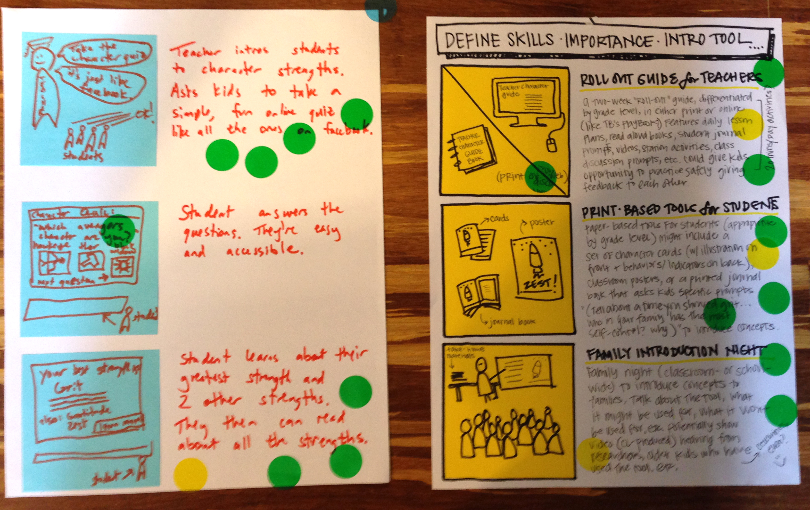

# Silent Critique

**Supplies needed:** Dot Stickers

**Estimated time:** 5 min

## Best to use when

Silent Critique is best to use after an individual thought process
like [Storyboards](storyboards.md).
It is a way to have a more unbiased and individual critique period.
This way all of the voices are heard
and not just the noisy decisive CEO.
It also cuts down on time
so that each person isn't presenting each of their own ideas.

They are part of the [Google Ventures
Diverge](http://www.gv.com/lib/the-product-design-sprint-divergeday2)
day cycle along with
[Mind Mapping](mind-mapping.md),
[Crazy Eights](crazy-eights.md), and
[Storyboards](storyboards.md).

See also [Dot voting](http://www.gamestorming.com/core-games/dot-voting/)
## Instructions:

1. Have everyone post their ideas up on a wall evenly space and at eye level.
Make sure each idea can stand on it's own and doesn't need an introduction or
description.
1. Give everybody a bunch of [dot stickers](http://www.amazon.com/dp/B002M3SBM2).
2. Then, without speaking, everybody looks at the different storyboards and puts a
sticker on every idea or part of an idea they like. There are no limits to how
many stickers you can use, and I don’t even prevent people who want to brazenly
vote for their own ideas.
3. By the end, you’ve got a kind of heat map, and some ideas are already standing out.
4. Jump into a [Group Critique](group-critique.md).

## Examples

